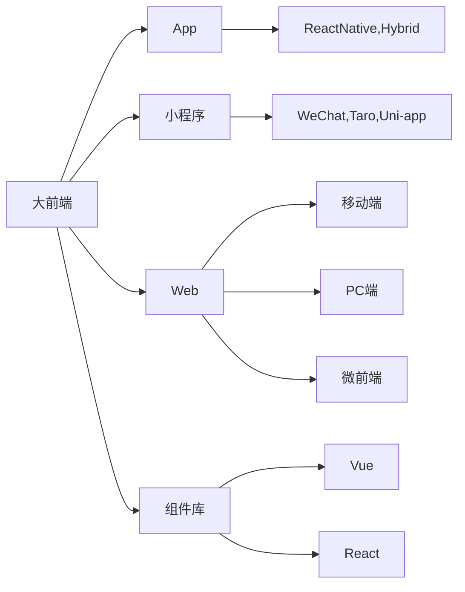

## About The Project

前端工程化脚手架-用于项目打包及构建等，提升研发效率，简化复杂流程。解决大前端团队底层工具链路的统一问题。



脚手架提供:

-   创建项目
-   项目运行
-   项目框架
-   项目打包
-   项目发布
-   ...

`web-project-build` 项目负责启动及项目打包工作。

## Getting Started

### Installation

1. Install NPM packages
    ```sh
    npm install
    ```

<!-- USAGE EXAMPLES -->

## Usage
