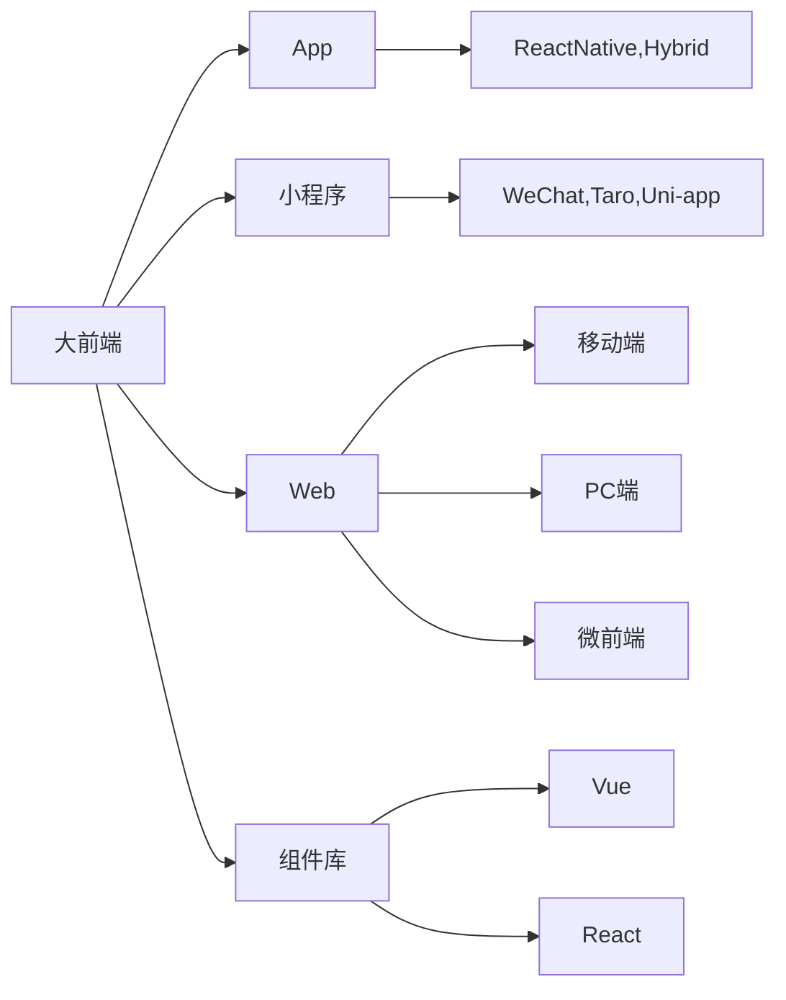

## About The Project

前端工程化脚手架-用于项目打包及构建等，提升研发效率，简化复杂流程。解决大前端团队底层工具链路的统一问题。



脚手架提供:

- 创建项目
- 项目运行
- 项目框架
- 项目打包
- 项目发布
- ...

`web-project-build` 项目负责启动及项目打包工作。

## Getting Started

### Installation

1. Install NPM packages

    ```sh
    npm install web-project-build -g
    ```

<!-- USAGE EXAMPLES -->

## Usage

```sh
    web-project-build start
    web-project-build build
```

参数:

- -c, --config: <自定义 config 配置文件>
- --stop-build: 停止启动服务(用于 start 命令)
- --custom-webpack-path: <自定义 webpack 路径>

**config 文件** wpb-config.js

```js
export default {
    // 入口文件
    entry: 'src/index.js',
    // 自定义插件
    plugins: function () {
        return [
            // 1. [插件路径，参数]
            ['.ugins/cli-build-plugin.js', { a: 1, b: 2 }],
            //2. 直接定义插件方法
            function (api, options) {
                console.log('this is anonymous plugin', options)
            }
        ]
    },
    // 自定义 Hooks 钩子
    hooks: [
        [
            'start',
            (context) => {
                console.log('start', context)
            }
        ],
        [
            'plugin',
            (context) => {
                console.log('testHook', context.webpackConfig?.toConfig())
            }
        ]
    ]
}
```
